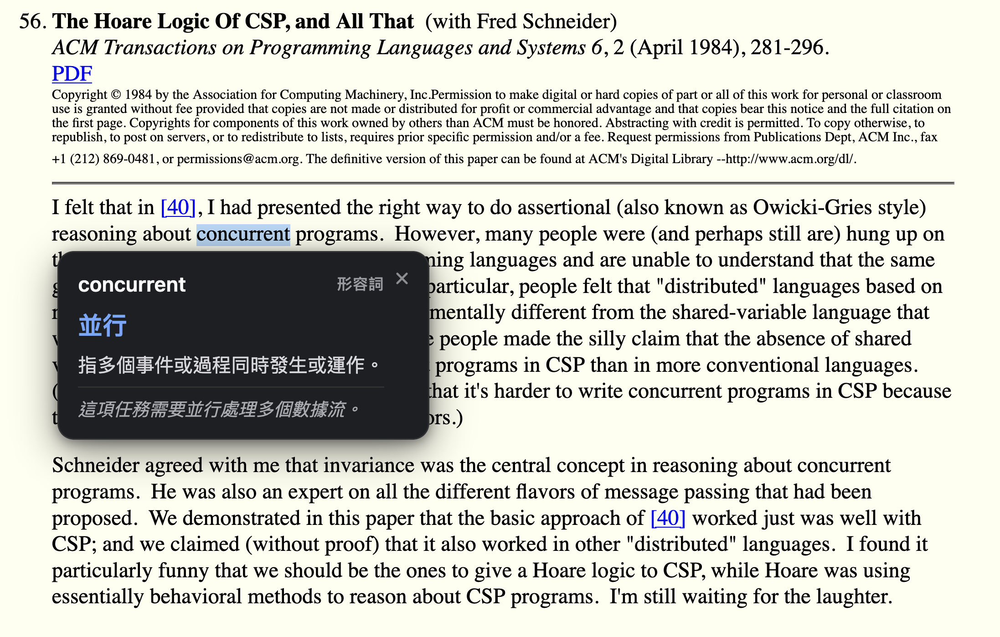
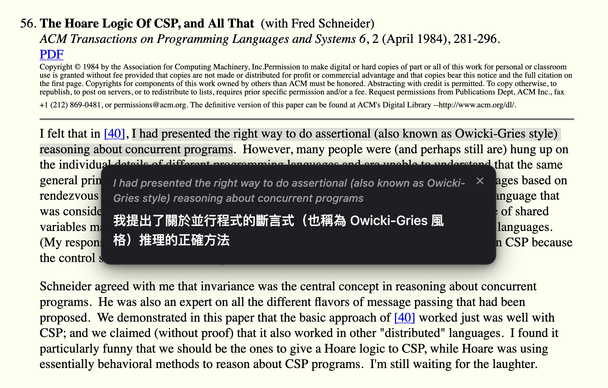
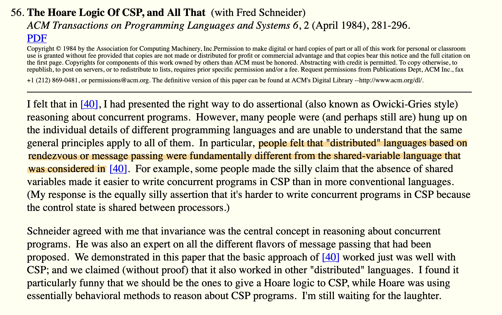
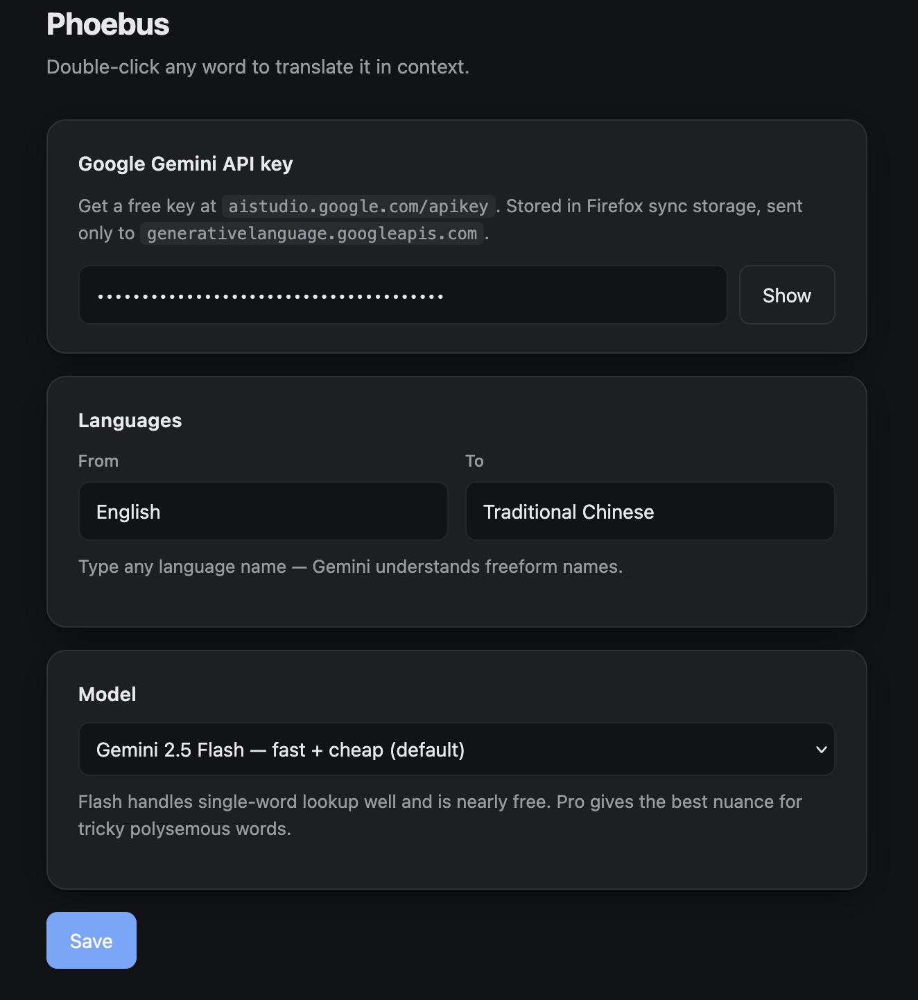

# Phoebus

> _Phoebus — the bright one, a byname of Apollo, god of language and meaning._

A Firefox extension that turns every web page into a language-learning
companion. Double-click a word for a **context-aware** translation from
Google Gemini, select a phrase for a natural full-sentence translation,
or highlight passages with a hand-drawn marker that survives page
reloads.

<p align="center">
  
</p>

**Bring your own** free Gemini API key. No server, no telemetry, no
tracking — every request goes straight from your browser to Google.

---

## Features

### Word lookup — double-click any word

The tooltip shows the **in-context** meaning (not a generic dictionary
entry), the translation, part of speech, and a natural example sentence
in your target language.

<p align="center">
  
</p>

### Phrase / sentence translation — select & click

Drag-select any phrase. A small floating toolbar appears above the
selection:

<p align="center">
  
</p>

Click **Translate** for a natural full-sentence translation with
optional notes on idioms, slang, or tricky references.

<p align="center">
  
</p>

### Hand-drawn highlighter that sticks

Click **Highlight** to wrap the selection in a slanted marker stroke —
the kind a real pen makes, not a rectangle. Highlights are saved to
local browser storage per URL, so they **survive page reloads and
browser restarts**.

<p align="center">
  
</p>

Click an existing highlight to **Adjust** the range or **Remove** it:

<p align="center">
  
</p>

### Draggable, dismissable UI

All floating boxes can be dragged around, closed with the `×` button,
or dismissed with `Esc`. They never hijack your scroll or selection.

### Your languages, your model

Source and target languages are fully configurable (any language Gemini
understands). Switch between `gemini-2.5-flash`, `flash-lite`, or `pro`
depending on the trade-off you want between latency and quality.

<p align="center">
  
</p>

---

## Install

- **Firefox (stable)** — from
  [addons.mozilla.org](https://addons.mozilla.org/) once the first
  review passes. Link will be added here.
- **From source** — see [Development](#development) below.

After installing, open **Preferences** (`about:addons` → Phoebus →
Preferences) and:

1. Paste your Google Gemini API key — get one free at
   <https://aistudio.google.com/apikey>
2. Confirm source / target languages (default: English → Traditional Chinese)
3. Pick a model (default: Gemini 2.5 Flash)
4. Click **Save**

---

## Privacy

The only outbound traffic is the Gemini API call, which sends your
selected text plus a short surrounding sentence for disambiguation, and
your API key, directly from the browser to Google. Nothing goes through
any third party.

Full disclosure in [`PRIVACY.md`](PRIVACY.md).

---

## Development

```bash
git clone git@github.com:jeffoodchain/phoebus.git
cd phoebus
npm install
npm run lint       # web-ext lint
npm run build      # unsigned .zip → web-ext-artifacts/
npm run run        # launch Firefox with the extension loaded
```

Or, without Node — load temporarily:

1. Open Firefox → `about:debugging#/runtime/this-firefox`
2. Click **Load Temporary Add-on…**
3. Select `manifest.json`

Temporary add-ons are wiped on Firefox restart. For a persistent install
before AMO review completes, see [`PUBLISH.md`](PUBLISH.md) for the
signing workflow.

### Project layout

| File | Role |
|---|---|
| `manifest.json` | MV3 manifest, Firefox gecko id, host perms for `generativelanguage.googleapis.com` |
| `background.js` | Message handler → Gemini `generateContent` API call |
| `content.js` | Double-click / selection listeners, tooltip rendering, highlight persistence |
| `content.css` | Tooltip / toolbar / highlight styles, dark-mode aware |
| `options.html/.js/.css` | Settings page (API key, languages, model) |
| `icons/icon.svg` | Toolbar / extension icon |
| `docs/screenshots/` | Images used in this README |
| `PRIVACY.md` | Privacy policy |
| `PUBLISH.md` | Release / AMO publishing walkthrough |
| `DECISIONS.md` | Design choices log |

---

## Contributing

Issues and pull requests welcome. For non-trivial changes, open an
issue first so we can talk through the approach.

## License

MIT — see [`LICENSE`](LICENSE).
